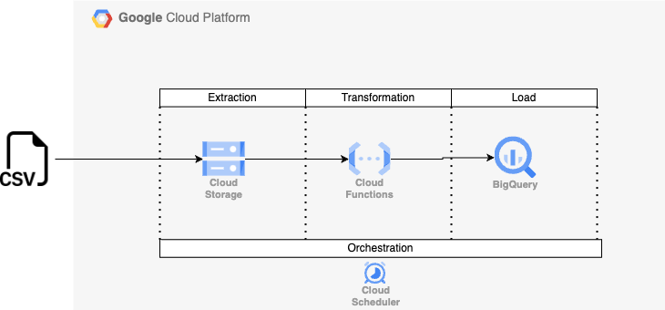

# Data Engineering Fundamentals

This section is focused on Data Engineering fundamentals such as:

* ETL vs. ELT.
* Data Warehousing.
* Orchestration.

## Hands-on Data Engineering

In this hands-on, you will create a simple ETL pipeline in GCP using:

* Cloud Storage
* Cloud Functions
* BigQuery
* Cloud Scheduler

### ETL Architecture

The following architecture illustrates the data flow in the ETL pipeline.

* CSV: a simple CSV file in the local machine.
* Cloud Storage: a bucket created to save the CSV file once it is uploaded manually.
* Cloud Function: a Python function to do a simple transformation in the data.
* BigQuery: the place where the transformed data is going to be uploaded.
* Cloud Scheduler: the simple orchestration tool to schedule a transformation trigger.
